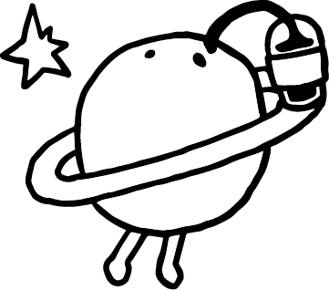
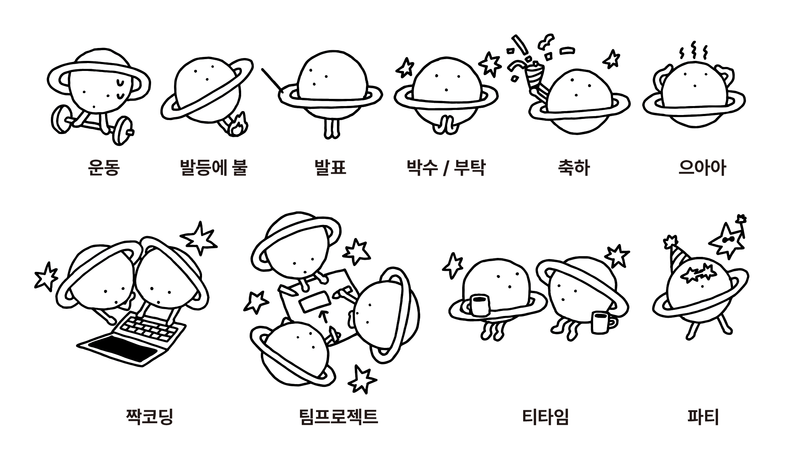

# 🪐 티뉴의 우아한테크코스

> _"내가 오늘 한 고민은, 내일의 내가 읽는다."_
>
> 우아한테크코스 8기 백엔드 과정을 거치며 학습한 미션 · 스터디 · 책을 모아두는 공간입니다.

 

## 🗓 기간

**2026.02 ~ 진행 중**

 

---

## 🌑 Level 1

> **객체지향과 페어 프로그래밍에 익숙해지는 단계.**
> Java로 도메인을 설계하고, AI · 페어와 함께 코드 리뷰를 주고받으며 자신의 코드를 설명할 수 있는 힘을 기릅니다.

### 🗓 기간

`2026.02 ~ 진행 중`

### 🎯 학습 내용

- **객체지향 설계** — 역할 · 책임 · 협력의 관점에서 도메인을 나눕니다.
- **값 객체(Value Object)** — 원시 타입 대신 의미를 가진 타입으로 도메인을 드러냅니다.
- **페어 프로그래밍** — 사람과 사람이 부딪히며 설계 합의를 만들어 갑니다.
- **코드 리뷰 사이클** — 사이클 1 · 2를 거치며 리뷰어 피드백을 구조 개선으로 반영합니다.
- **AI 협업 경계** — AI에게 맡길 일과 내가 판단해야 할 일을 구분합니다.
- **테스트 주도 개발** — 도메인의 경계를 테스트로 먼저 표현합니다.

### 🚀 진행 미션

| 주차 | 미션 | 저장소 | Pull Request | 회고 |
|:---:|:---|:---:|:---:|:---:|
| 1주차 | 🧪 Gemini Canvas 웹앱 | [gemini-canvas-mission](https://github.com/JohnPrk/gemini-canvas-mission) | [#89](https://github.com/woowacourse/gemini-canvas-mission/pull/89) | [📖](https://johnprk.github.io/woowacourse/gemini-canvas/) |
| 2주차 | 🂡 블랙잭 — 사이클 1 | [java-blackjack](https://github.com/JohnPrk/java-blackjack) | [#932](https://github.com/woowacourse/java-blackjack/pull/932) | [📖](https://johnprk.github.io/woowacourse/blackjack-cycle-1/) |
| 3주차 | 🂡 블랙잭 — 사이클 2 | [java-blackjack](https://github.com/JohnPrk/java-blackjack) | [#1055](https://github.com/woowacourse/java-blackjack/pull/1055) | [📖](https://johnprk.github.io/woowacourse/blackjack-cycle-2/) |
| 4주차 | ♟ 장기 — 사이클 1 | [java-janggi](https://github.com/JohnPrk/java-janggi) | [#204](https://github.com/woowacourse/java-janggi/pull/204) | [📖](https://johnprk.github.io/woowacourse/janggi-cycle-1/) |
| 5주차 | ♟ 장기 — 사이클 2 | [java-janggi](https://github.com/JohnPrk/java-janggi) | [#298](https://github.com/woowacourse/java-janggi/pull/298) | [📖](https://johnprk.github.io/woowacourse/janggi-cycle-2/) |

 

_☕ 커피 한 잔 수혈하고 계속 갑니다._

 

---

## 🌘 Level 2

> **Spring과 데이터베이스로 서버 한 대를 온전히 끌고 가보는 단계.**
> _(예정)_

### 🗓 기간

`추후 업데이트`

### 🎯 학습 내용

_레벨이 시작되면 이곳에 채워집니다._

### 🚀 진행 미션

| 주차 | 미션 | 저장소 | Pull Request | 회고 |
|:---:|:---|:---:|:---:|:---:|
| — | _(예정)_ | — | — | — |

 

---

## 🌗 Level 3

> **팀 프로젝트 — 아이디어가 서비스가 되는 단계.**
> _(예정)_

### 🗓 기간

`추후 업데이트`

### 🎯 학습 내용

_레벨이 시작되면 이곳에 채워집니다._

### 🚀 진행 미션

| 주차 | 미션 | 저장소 | Pull Request | 회고 |
|:---:|:---|:---:|:---:|:---:|
| — | _(예정)_ | — | — | — |

 

---

## 🌖 Level 4

> **인프라 · 운영 · 확장 — 내 서비스를 책임지는 단계.**
> _(예정)_

### 🗓 기간

`추후 업데이트`

### 🎯 학습 내용

_레벨이 시작되면 이곳에 채워집니다._

### 🚀 진행 미션

| 주차 | 미션 | 저장소 | Pull Request | 회고 |
|:---:|:---|:---:|:---:|:---:|
| — | _(예정)_ | — | — | — |

 

---

## 📚 스터디

> 우테코 동료들과 함께, 혹은 혼자서 파고든 주제를 정리합니다.

| 주제 | 내용 | 링크 |
|:---:|:---|:---:|
| _(예정)_ | 스터디가 쌓이는 대로 정리합니다. | — |

 

## 📖 책

> 읽은 책과 거기서 얻은 생각, 코드에 적용해본 것을 남깁니다.

| 책 | 한줄 메모 | 정리 |
|:---:|:---|:---:|
| _(예정)_ | 읽은 책이 생기면 여기에 채웁니다. | — |

 

---

  🌱 <b>아직 자라는 중인 기록입니다.</b> 
  미션이 끝날 때마다, 책을 한 권 덮을 때마다, 스터디 한 회가 끝날 때마다 이 저장소는 조금씩 두꺼워집니다.

  

  Made by <a href="https://github.com/JohnPrk"><b>티뉴 (JohnPrk)</b></a> · 우아한테크코스 8기 백엔드

